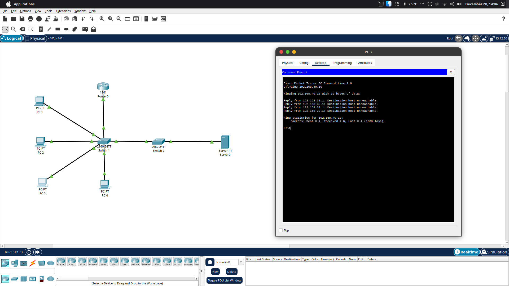

# Enterprise-Style Inter-VLAN Routing

This project demonstrates inter-VLAN routing in an enterprise-style network topology using Cisco Packet Tracer. It focuses on logical network segmentation with VLANs and enabling Layer 3 communication between VLANs.

## Network Topology
- Multiple VLANs representing different departments  
- Switches configured for VLAN segmentation  
- Layer 3 device configured to route traffic between VLANs  

## Key Configurations
- VLAN creation and assignment  
- Trunk configuration between switches  
- Layer 3 routing between VLANs  
- Default gateway configuration  

## Verification
- Verified inter-VLAN routing where allowed  
- Confirmed enterprise access control restricting guest VLAN access  

## Access Control Policy
An ACL was implemented to restrict guest VLAN traffic while allowing internal VLAN communication, reflecting a real-world enterprise access policy.

## Tools Used
- Cisco Packet Tracer

## Outcome
This project demonstrates how enterprise networks use VLANs to segment users and apply Layer 3 routing to control communication between them. It also shows how access control policies can be enforced to restrict guest traffic while protecting internal resources. The lab reflects real-world networking practices relevant to entry-level Network Support and NOC roles.
